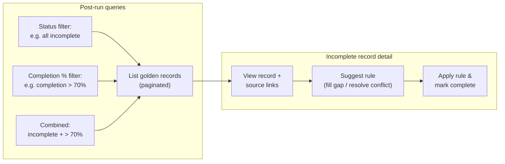
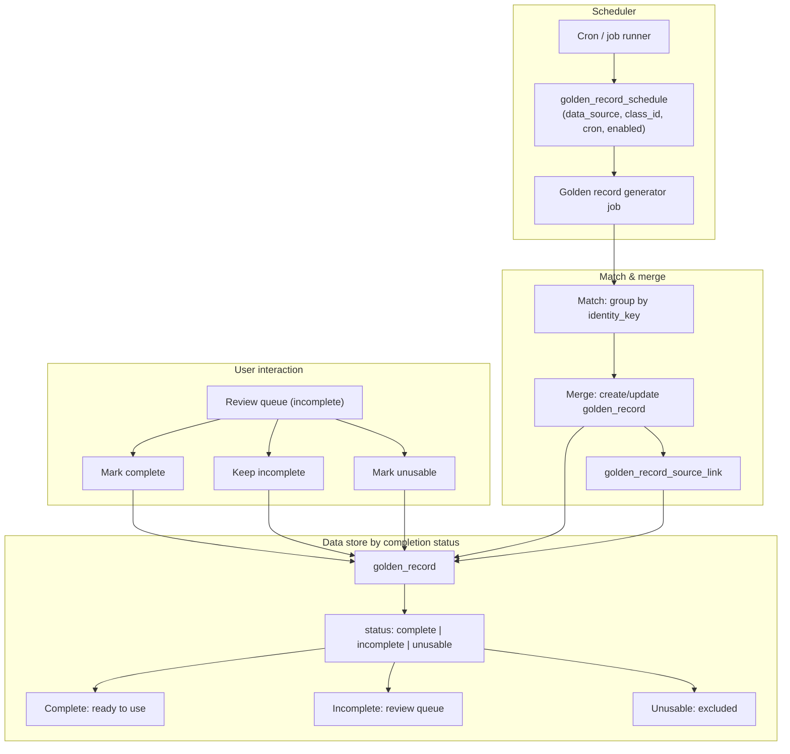
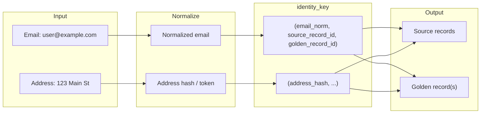
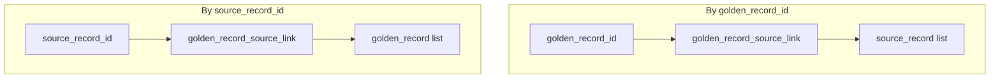
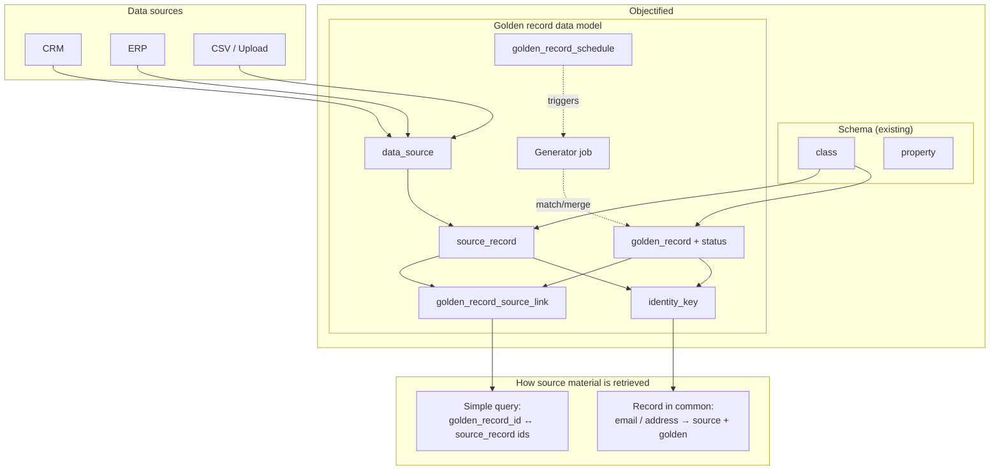

# Roadmap: Golden Record Studio

This document outlines a possible roadmap for building **golden records** on top of Objectified’s schema design and a custom database. A golden record is a single, authoritative record that combines data from multiple sources into one. A core requirement is that the underlying source material remains **easily retrievable**—either by a simple query or via a shared “record in common” (e.g. email, address similarity).

---

## 1. Overview

### 1.1 What is a Golden Record?

A **golden record** is the system’s chosen “best” representation of a real-world entity (e.g. a person, organization, or place). It is built by:

- Ingesting or linking to records from **multiple data sources**
- **Matching** records that refer to the same entity (identity resolution)
- **Merging** matched records using rules (e.g. “prefer source A for email, source B for address”) into one record
- Storing that merged result as the golden record and **preserving links** back to every contributing source record

### 1.2 Why Source Traceability Matters

When creating or updating a golden record, users and systems must be able to:

1. **Retrieve by simple query**  
   e.g. “All source records that contributed to this golden record” or “All golden records that used this source record.”

2. **Retrieve by “record in common”**  
   e.g. “All records (across sources) that share this email” or “Records with similar address,” so that the same linkage logic used to build the golden record can be reused for discovery and audit.

The roadmap and diagrams below assume both capabilities are first-class.

---

## 2. Relationship to Existing Objectified Schema

Objectified already provides:

- **Schema design**: `tenant` → `project` → `version` → `class`; `property`; `class_property` (classes and their properties).
- **Versioning**: `version_snapshot`, `version_history` for schema state.
- **Import**: OpenAPI / JSON Schema import into classes and properties.

Golden records and source traceability build on this by:

- Using **class** (and its schema) to define the *shape* of both source records and golden records.
- Introducing a **custom database** (or dedicated schema/tables) for:
  - **Source records**: one table (or partition) per “data source” or a generic store keyed by `(source_id, class_id)`.
  - **Golden records**: one logical record per entity, keyed by a stable **golden record id**, with payload conforming to a class schema.
  - **Linkage tables**: which source record ids contributed to which golden record, and optional **identity keys** (e.g. email, normalized address) used for “record in common” retrieval.

Diagrams below show how these pieces fit together.

---

## 3. High-Level Architecture

```mermaid
flowchart TB
    subgraph Schema Layer["Schema layer (existing)"]
        tenant[tenant]
        project[project]
        version[version]
        class[class]
        property[property]
        class_property[class_property]
        tenant --> project --> version --> class
        class --> class_property --> property
    end

    subgraph Data Layer["Data layer (custom DB / new tables)"]
        source_registry[data_source]
        source_records[source_record]
        golden_records[golden_record]
        golden_source_link[golden_record_source_link]
        identity_key[identity_key / record_in_common]
        source_registry --> source_records
        class --> source_records
        class --> golden_records
        golden_records --> golden_source_link --> source_records
        identity_key --> source_records
        identity_key --> golden_records
    end

    subgraph Retrieval["Retrieval paths"]
        q1["Simple query: by golden_record_id → sources"]
        q2["Record in common: by email / address → sources & golden"]
        q1 --> golden_source_link
        q2 --> identity_key
    end
```

---

## 4. Data Model (Conceptual)

### 4.1 Core Entities

| Entity | Purpose |
|--------|--------|
| **data_source** | Registry of external or internal systems (e.g. CRM, ERP, CSV upload). Scoped to project/version. |
| **source_record** | One row per record from a source; holds `source_id`, `class_id`, external id, and a JSONB payload (and optionally a dedicated table per class). |
| **golden_record** | One row per entity; holds `class_id`, stable id, and merged JSONB payload. |
| **golden_record_source_link** | Many-to-many: which `source_record`(s) contributed to which `golden_record`, plus optional role (e.g. “primary email”). |
| **identity_key** | “Record in common” keys: e.g. normalized email, address hash, or external id. Links to `source_record` and/or `golden_record` for fast lookup. |

### 4.2 Record Completion State (Complete vs Incomplete vs Unusable)

Golden records and candidate groups are stored with a **completion status** so the system can separate records that are ready to use from those that need user action or should be excluded.

| Status | Meaning | Data store / usage |
|--------|--------|---------------------|
| **complete** | Golden record is fully merged and approved for use; no user action required. | Queryable as “production” golden records; included in downstream exports and APIs by default. |
| **incomplete** | Record needs user interaction: resolve conflicts, fill gaps, or confirm merge. | Stored in the same `golden_record` table (or staging table) with status; surfaced in a **review queue** so users can complete or reject. |
| **unusable** | User (or system) marked as not usable (e.g. duplicate, wrong entity, bad data). | Same store with status; excluded from “complete” views and downstream use; optionally retained for audit. |

**Data store approach:**

- **Single table with status**: Add a `status` column to `golden_record` (e.g. `complete`, `incomplete`, `unusable`) and optional `status_reason` / `updated_by` / `status_at`. Optionally add **completion_pct** (0–100) so the query layer can filter by “completion &gt; 70%” etc.; indices on `(class_id, status)` and optionally `(class_id, status, completion_pct)`.
- **Optional staging table**: For “candidate” golden records not yet committed, a `golden_record_candidate` (or `golden_record_staging`) table with the same shape plus status; once user marks complete, row is promoted to `golden_record` with status `complete`. Alternatively, keep one table and use status only.
- **Review queue**: “Incomplete” and “unusable” records are retrieved by filtering on status; users can change status to `complete`, keep as `incomplete`, or set to `unusable`.

This gives a clear data store for records that are **complete** (ready to use), **incomplete** (require interaction), or **unusable** (excluded), with simple queries and UI filters.

### 4.3 Retrieval Paths

- **Simple query**  
  Given `golden_record_id` → query `golden_record_source_link` → get all `source_record` ids (and then fetch full records).  
  Reverse: given `source_record_id` → query `golden_record_source_link` → get `golden_record_id`(s).

- **Record in common**  
  Given email (or address) → normalize → lookup `identity_key` → get linked `source_record`(s) and/or `golden_record`(s).  
  Supports “show me every source record and golden record that share this email/address.”

---

## 5. Scheduler for Golden Record Generation

The golden record **match/merge** process (identity resolution + merge) can be run on a schedule so that new or updated source data is periodically turned into golden records without manual triggers.

**Scheduler design:**

- **What runs**: A “golden record generator” job that, for a given scope (e.g. project, version, data_source, class_id), runs the match step (group source records by identity keys), then the merge step (create/update golden records and links). Optionally, newly created or updated golden records start in status `incomplete` and move to `complete` only after user review or after automated rules.
- **Where it runs**: A scheduled job runner (e.g. cron, Celery, APScheduler, or a cloud scheduler) that invokes an internal API or a dedicated worker. The job is configured per data_source and/or class (e.g. “run nightly for CRM + Person”).
- **Configuration**: Store schedule and scope in the database (e.g. `golden_record_schedule` table: data_source_id, class_id, cron_expression or interval, enabled, last_run_at, next_run_at). REST API to create/update/disable schedules; the scheduler process reads this table and enqueues or runs jobs accordingly.
- **Idempotency and incremental runs**: Match/merge should support incremental runs (e.g. only new/updated source_record rows since last run) to avoid reprocessing everything. Last run timestamp (and optionally a cursor) stored per schedule.

This allows the golden record generator to run automatically (e.g. daily or hourly) while keeping source traceability and completion status intact.

---

## 6. Queryable Component (Post-Run)

After the golden record generator runs (on a schedule or manually), users and systems need a **queryable layer** to find and work with golden records. This includes filtering by completion state, by completion percentage, and getting help to finish incomplete records with simple rules.

### 6.1 What Can Be Queried

- **By status**  
  e.g. “Show me all incomplete records,” “Show me all complete records,” “Show me unusable records.” Implemented as filters on `golden_record.status` (and optional class_id / data_source scope). APIs and UI expose these as standard list filters with pagination.

- **By completion percentage**  
  e.g. “Show me records with completion percentage &gt; 70%.” Supports prioritising the review queue (e.g. nearly-complete records first) or reporting on data quality.
  - **Definition of completion %**: Based on the class schema—e.g. the share of “required” or “expected” properties that are non-null and non-empty in the golden record payload. Optional properties can be weighted less or ignored. Formula: `(filled_required + optionally filled_optional) / total_expected * 100`.
  - **Storage vs computation**: Either (a) store `completion_pct` on `golden_record` (updated on merge and when the payload is edited), or (b) compute on read from payload + class schema. Stored value allows fast filtering and indexing (e.g. index on `(class_id, status, completion_pct)`); computed value stays accurate if schema or rules change. A hybrid is possible (e.g. recompute in the generator and on save, then store).
  - **Query**: List golden records with filter `completion_pct >= 70` (and optionally `status = incomplete`). Same filter available in REST and in the UI (e.g. slider or numeric filter).

- **Combined filters**  
  e.g. “Incomplete records with completion &gt; 70%” or “Complete records for class X.” The query component supports combining status, completion_pct, class_id, data_source (via linked source records), and date ranges.

### 6.2 Rule Assistance for Incomplete Records

When a user is viewing an **incomplete** golden record, the system can **help write a rule to complete it**—especially when the remaining data cleansing steps are fairly trivial (e.g. one missing field available from a linked source, or a single conflict between two sources).

**Capabilities:**

- **Context**: On the record detail view, the system has the golden record payload, the class schema (required/optional properties), and all linked `source_record` payloads. It can detect gaps (missing required or desired fields) and conflicts (same property with different values across sources).
- **Suggest rules**: Propose concrete rules such as: “Use value from Source A for `email` when present,” “Default `phone` from CRM when golden record has none,” “When conflict on `address`, prefer source with latest updated_at.” Rules can be one-off (apply to this record only) or saved as merge/cleanse rules for the class or data source.
- **Apply and complete**: For trivial cases (e.g. one or two fill-ins from a single source, or one conflict resolved by a simple rule), the user can “Apply suggested rule” or “Apply rule and mark complete.” The system updates the golden record payload, optionally persists the rule for reuse, and sets status to `complete` so the record leaves the review queue.
- **UI**: A “Help me complete this record” or “Suggest rule” action on the incomplete-record view; a small panel or modal showing suggested rules and a button to apply and mark complete (or to save the rule for later use without marking complete).

This keeps the queryable component focused on **finding** the right records (by status and completion %) and **finishing** them when the remaining steps are simple, without requiring heavy manual editing.

### 6.3 Diagram: Queryable Component and Rule Assistance



- **Left**: After the plan runs, users query by status, completion percentage, or both; results are listed with pagination.
- **Right**: From the list, user opens an incomplete record; system suggests rules from linked sources; for trivial cases, user applies rule and marks complete.

---

## 7. Diagram: Scheduler and Record Completion State



- **Top**: Scheduler reads `golden_record_schedule` and runs the generator job (match + merge) on a schedule.
- **Center**: Match/merge writes to `golden_record` and links; records can be created with status `incomplete` for review.
- **Bottom**: Data store holds all golden records with a status; users work from the incomplete queue to mark records **complete**, **incomplete**, or **unusable**.

---

## 8. Diagram: Source to Golden Record Flow

```mermaid
sequenceDiagram
    participant S1 as Source A
    participant S2 as Source B
    participant Ingest as Ingest / ETL
    participant SR as source_record
    participant IdKey as identity_key
    participant Match as Match & Merge
    participant GR as golden_record
    participant Link as golden_record_source_link

    S1->>Ingest: Records (e.g. email, name, address)
    S2->>Ingest: Records (e.g. email, name, phone)
    Ingest->>SR: Insert source_record per source
    Ingest->>IdKey: Index email, address, etc.
    Match->>IdKey: Lookup by email / address
    IdKey-->>Match: candidate source_record ids
    Match->>Match: Resolve identity, merge rules
    Match->>GR: Insert or update golden_record
    Match->>Link: Link golden_record ↔ source_records
    Match->>IdKey: Update identity_key for golden_record
```

---

## 9. Diagram: Record-in-Common Retrieval



---

## 10. Diagram: Simple Query Retrieval (Source ↔ Golden)



---

## 11. Roadmap Phases

### Phase 1: Foundation (Schema + Source Registry)

- **Goals**: Define the schema for golden records and sources without storing instance data yet.
- **Deliverables**:
  - Design and document `data_source` (and optionally `source_record`, `golden_record`, `golden_record_source_link`, `identity_key`) in the Objectified schema or a dedicated design doc.
  - Add `data_source` table (and migrations) in objectified-schema: id, project_id/version_id, name, type, config (JSONB), enabled, created_at, updated_at, deleted_at.
  - REST: CRUD for data sources (create, read, update, soft-delete) with OpenAPI.
  - No “record in common” or merge logic yet; focus on registry and alignment with existing tenant/project/version/class model.

### Phase 2: Source Record Storage and Ingestion

- **Goals**: Persist records from external sources and tie them to a class.
- **Deliverables**:
  - `source_record` table(s): source_id, class_id, external_id, payload (JSONB), created_at, updated_at, deleted_at; indices for (source_id, class_id), external_id.
  - Ingestion API or jobs: accept payloads keyed by class, validate against class schema (optional), write to `source_record`.
  - Simple query: “List source records for a given data_source and optional class_id” with pagination.

### Phase 3: Identity Keys and “Record in Common”

- **Goals**: Support retrieval by shared identifiers (e.g. email, address).
- **Deliverables**:
  - `identity_key` table: type (e.g. email, address_hash), normalized_value, source_record_id, golden_record_id (nullable), created_at. Indices on (type, normalized_value).
  - Strategy for normalization: e.g. lowercased email, trimmed; address: tokenization or hashing for similarity.
  - API: “Find all source records and golden records by identity key” (e.g. by email or address).
  - Optional: similarity for addresses (e.g. token overlap, or use pgvector if needed later).

### Phase 4: Golden Record, Linkage, and Completion Status

- **Goals**: Create golden records, maintain explicit links to source records, and store completion state (complete / incomplete / unusable).
- **Deliverables**:
  - `golden_record` table: id (UUIDv7), class_id, payload (JSONB), **status** (e.g. `complete`, `incomplete`, `unusable`), optional **completion_pct** (0–100, derived from payload vs class schema), status_reason, updated_by, status_at, created_at, updated_at, deleted_at. Indices on (class_id, status) and optionally (class_id, status, completion_pct) for the queryable component.
  - `golden_record_source_link` table: golden_record_id, source_record_id, role (optional), created_at. Indices for both directions.
  - **Data store semantics**: Complete = ready to use; incomplete = needs user interaction; unusable = excluded. Queries and APIs filter by status as needed.
  - Service/API: “Create golden record from a set of source_record ids” with a merge strategy (e.g. first-wins, or configurable per-property); support setting initial status (e.g. `incomplete` for review).
  - Simple query API: “Get all source records for a golden record” and “Get golden record(s) for a source record.” List golden records filtered by status (complete, incomplete, unusable) and optionally by completion_pct (e.g. completion_pct >= 70).

### Phase 5: Match and Merge (Identity Resolution) and Scheduler

- **Goals**: Automate grouping of source records and creation/update of golden records; run the generator on a schedule.
- **Deliverables**:
  - Match step: use identity_key (and optionally rules) to propose groups of source_record ids that represent the same entity.
  - Merge step: apply merge rules (defined per class or per property) to produce golden record payload; persist golden_record (with initial status, e.g. `incomplete` or `complete` per config), golden_record_source_link; update identity_key for golden_record.
  - API or job: “Run match/merge for a data_source and class_id” (batch or incremental). Job is invokable by the scheduler or manually.
  - **Scheduler**: `golden_record_schedule` table (e.g. data_source_id, class_id, cron_expression or interval_seconds, enabled, last_run_at, next_run_at). A scheduler process (cron, Celery beat, APScheduler, or cloud scheduler) reads enabled schedules and runs the golden record generator job at the configured times. Support idempotent, incremental runs where possible.
  - Audit: ensure every golden record has at least one link in golden_record_source_link and that source material is retrievable by simple query and by record in common.

### Phase 6: UI and Operations (Including Query Component, Review Queue, and Rule Assistance)

- **Goals**: Make golden records and source traceability usable in the Objectified UI; support the **queryable component** (status, completion %), completion workflow, **rule assistance** for incomplete records, and scheduler configuration.
- **Deliverables**:
  - **Queryable component**: List golden records per class with **status filters** (complete, incomplete, unusable) and **completion percentage filter** (e.g. “completion &gt; 70%”). Support combined filters (e.g. incomplete + completion_pct >= 70). Expose same filters in REST and UI with pagination.
  - UI: drill into a golden record to see contributing source records (simple query).
  - **Review queue**: dedicated view for **incomplete** records; user can edit/merge conflicts, then **mark complete**, **keep incomplete**, or **mark unusable** (with optional reason). Status and optional status_reason persisted in the data store.
  - **Rule assistance**: On the incomplete-record detail view, “Help me complete this record” / “Suggest rule”: analyze payload vs linked source records and class schema; suggest rules (e.g. “Use email from Source A,” “Default phone from CRM”). For trivial cases, “Apply rule and mark complete” to update payload and set status to complete. Option to save suggested rule for the class or data source for reuse.
  - UI: search by “record in common” (e.g. email) and show matching source records and golden records; filter by status and completion_pct where relevant.
  - **Scheduler UI**: list/create/edit/disable schedules (golden_record_schedule); show last_run_at, next_run_at, and job history or logs where available.
  - Configuration UI for data sources, identity key types, and merge rules (where applicable).
  - Logging and monitoring for ingestion, match/merge jobs, and scheduler runs.

---

## 12. Summary

| Requirement | How it’s addressed |
|------------|----------------------|
| Golden record = single record from multiple sources | `golden_record` holds merged payload; `golden_record_source_link` ties it to many `source_record` rows. |
| Source material easily retrievable by **simple query** | Query `golden_record_source_link` by `golden_record_id` or `source_record_id` to get the other side; then load full records from `source_record` / `golden_record`. |
| Source material easily retrievable by **record in common** | `identity_key` stores normalized values (e.g. email, address); lookup by (type, value) returns linked `source_record`(s) and `golden_record`(s). |
| **Scheduler for golden record generator** | `golden_record_schedule` stores scope (data_source, class_id) and schedule (cron or interval); a scheduler process runs the match/merge job on a schedule. |
| **Data store: complete vs incomplete vs unusable** | `golden_record.status` (e.g. `complete`, `incomplete`, `unusable`); complete = ready to use; incomplete = review queue for user interaction; unusable = excluded. Queries and UI filter by status. |
| **Queryable component (post-run)** | Query by status (“show me all incomplete records”), by **completion percentage** (e.g. “completion &gt; 70%”), and combined filters. `completion_pct` on golden_record (or computed from payload + class schema). REST and UI expose list with filters and pagination. |
| **Rule assistance for incomplete records** | On incomplete-record view: suggest rules to fill gaps or resolve conflicts from linked sources; “Apply rule and mark complete” for trivial cleansing; option to save rule for class/data source. |
| Align with schema design | All record tables reference `class_id`; payload shape is defined by the class (and property) definitions in the existing Objectified schema. |
| Custom database | New tables live in the same DB (objectified schema) or a dedicated schema/DB; ingestion and match/merge can run in application layer or background jobs. |

This roadmap keeps schema design central, uses a custom database (or dedicated tables) for source and golden records, ensures that both **simple query** and **record in common** (email, address similarity, etc.) are first-class ways to retrieve the source material behind every golden record, adds a **scheduler** to run the golden record generator on a schedule, provides a **data store for completion status** (complete, incomplete, unusable), and adds a **queryable component** after the plan runs: filter by status and **completion percentage** (e.g. &gt; 70%), and **rule assistance** to help users write and apply rules to complete incomplete records when cleansing is fairly trivial.

---

## 13. Feature Implementation Overview (Single View)



- **Top**: Multiple sources register as `data_source` and feed `source_record` (shaped by `class`).
- **Center**: `golden_record` (with status: complete / incomplete / unusable) is merged from multiple `source_record`s; `golden_record_source_link` and `identity_key` provide traceability; `golden_record_schedule` drives the scheduler.
- **Bottom**: Source material is retrievable via simple query (link table) or record in common (identity_key). Scheduler runs the generator job on a schedule.
